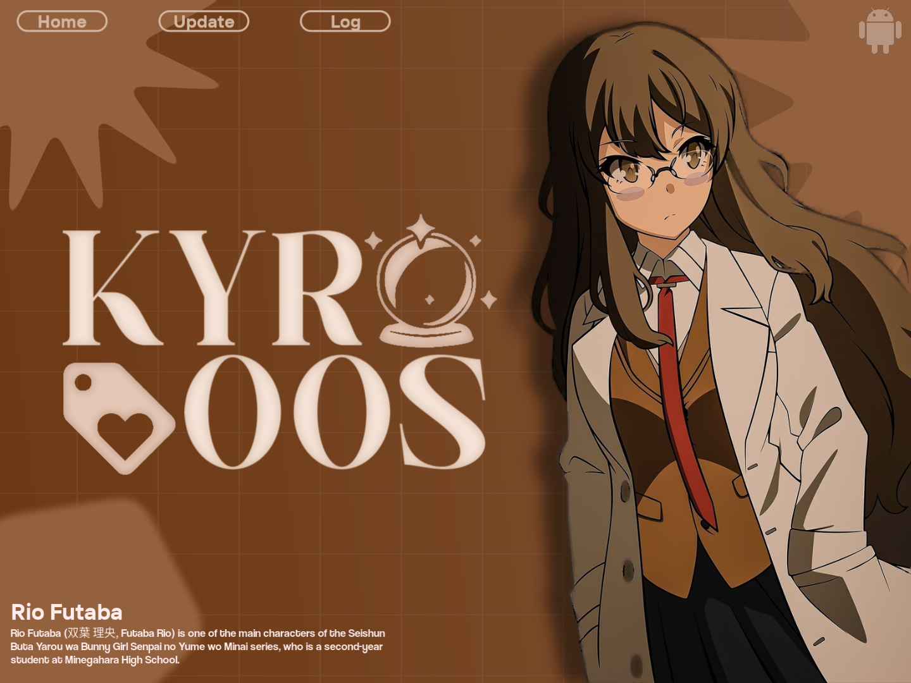

#KyrooS

KyrooS is a powerful system optimization and power management utility designed to enhance the performance and longevity of your Android device. By leveraging advanced system-level integrations, KyrooS provides users with deep control over background processes, battery consumption, and overall system responsiveness.

---

✨ Key Features

🔋 Intelligent Power Management

KyrooS monitors your device state in real-time to automate energy-saving measures. It intelligently adjusts power profiles based on battery levels and screen activity, ensuring you have power when you need it most.

🛠️ Advanced App Optimization

Take control of background resource usage. KyrooS allows you to optimize how applications behave behind the scenes, effectively reducing wake-locks and background data usage without compromising functionality.

⚡ System Responsiveness

Keep your device feeling snappy. Through efficient memory and cache management, KyrooS helps maintain a smooth user experience by preventing system bloat and resource exhaustion.

🛡️ Secure System Integration

Built on the robust Shizuku API, KyrooS performs high-level optimizations securely. It offers the depth of traditional system tweaks with a modern, secure approach to permission management.

🧹 Storage Cleaner

Intelligently identifies and removes junk files, cache, and temporary data without affecting your personal files or app functionality.

---

📖 How to Use

1. Prerequisite: Ensure you have Shizuku installed and running on your device.
2. Setup: Open KyrooS and grant the necessary permissions via Shizuku when prompted.

---

📱 Compatibility

· Android Version: Supports Android 7.0 (Nougat) and higher (API 24+).
· Architecture: Optimized for all modern Android architectures (ARM, ARM64, x86).
· Requirement: Functional Shizuku environment is required for full feature access.

---

🔒 Permissions & Privacy

Respecting Your Privacy

KyrooS is designed with privacy as a priority. No personal data is collected, stored, or transmitted. All optimization logic and system tweaks are performed locally on your device.

Essential Permissions

· Shizuku: Used for secure, elevated access to perform deep system optimizations.
· Write Secure Settings: Allows the app to manage advanced system features like power-saving modes.
· Notifications: Keeps you informed about optimization results and service status.
· Storage Access: Required solely for managing optimization configurations locally.

---

🌟 Benefits

· Extended Battery Life: Spend less time at the charger with smarter energy use. Users report up to 30% longer standby time.
· Improved Performance: Reduce lag and stutter during daily use and gaming. Apps launch faster, multitasking feels smoother.
· Better Device Health: Minimize unnecessary background strain on your hardware, potentially extending the lifespan of your device.
· More Free Storage: Automatically clean junk files and optimize storage usage without losing important data.
· Simple & Effective: A clean, intuitive interface that delivers powerful results without the complexity.

---

🤝 Contributing

Contributions are welcome! Whether it's bug reports, feature suggestions, or code contributions, your help makes KyrooS better.

· Report Bugs: Open an issue on GitHub with your device model, Android version, and steps to reproduce,
· Suggest Features: Have an idea? Open a feature request and describe the use case.
· Submit Code: Fork the repository, make your changes, and submit a pull request.

---

👏 Credits

@Dcx400 (Telegram) - Original Klixr logging tweaks

RikkaApps - Shizuku API (https://github.com/RikkaApps/Shizuku)

@sipurse (Telegram) - KyrooS Banner

---
📪Connect With Us

 
---

  © 2026 KyrooS Development Team. 

